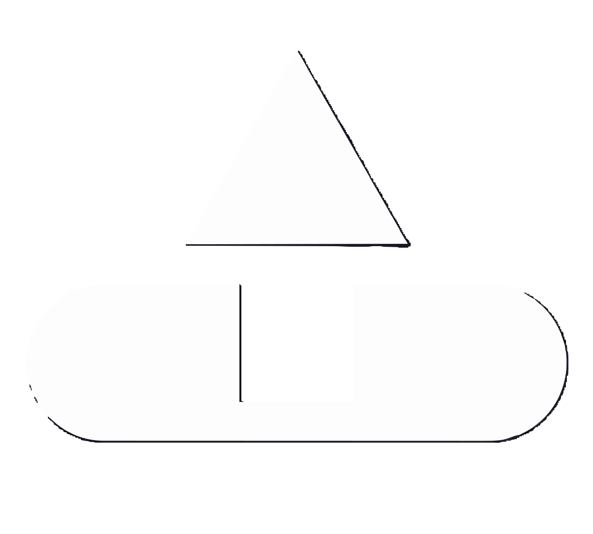
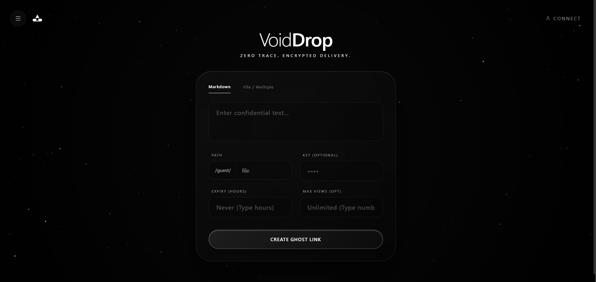
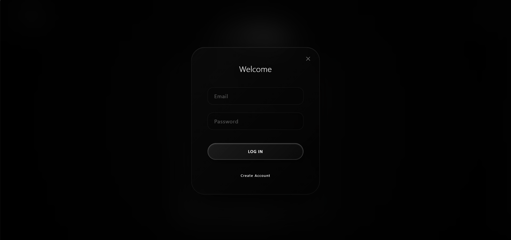
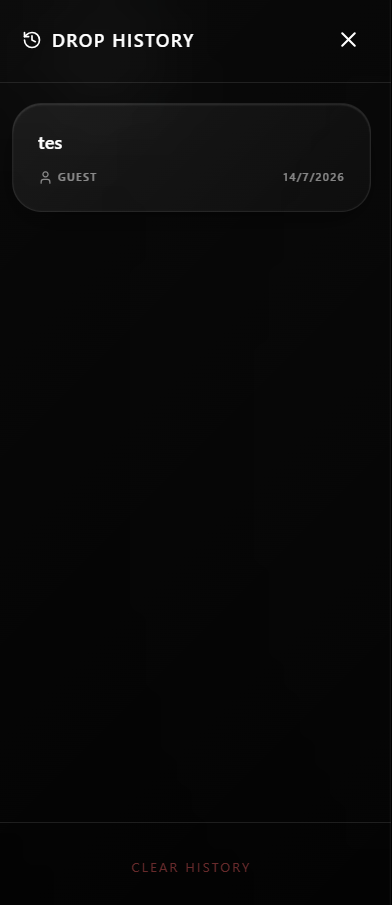
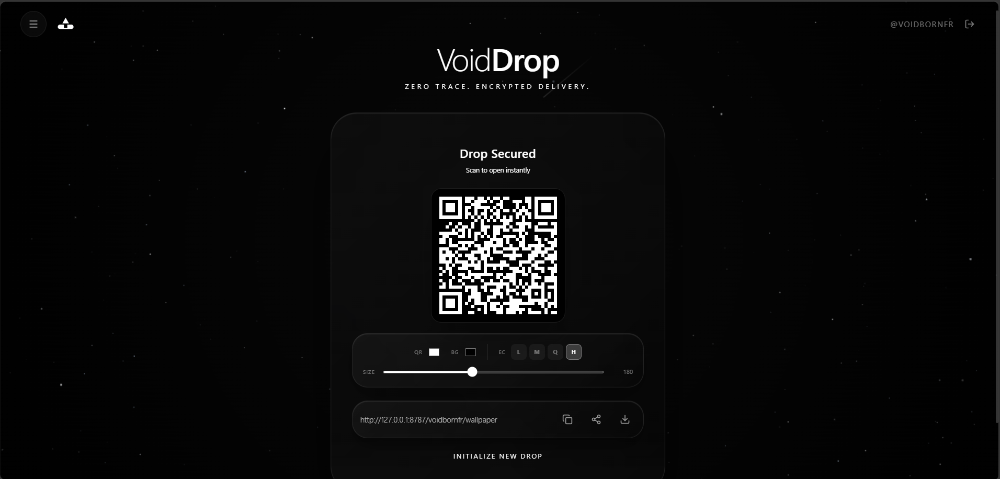
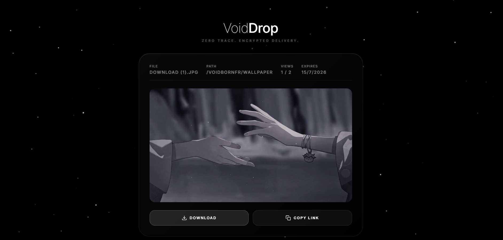

<div align="center">
  
  
  # VoidDrop.
  
  **Zero trace. Encrypted delivery.**
  
  An ultra-fast, local-first, zero-database workspace for sharing markdown text, code snippets, and files securely with short redirection URLs.

  <p align="center">
    <a href="#features">Features</a> •
    <a href="#preview">Preview</a> •
    <a href="#tech-stack">Tech Stack</a> •
    <a href="#getting-started">Getting Started</a>
  </p>
</div>

---

## ✨ Features

- **Liquid Glass UI**: A cinematic, highly aesthetic interface with real-time hover physics, deep blurs, and micro-animations.
- **Custom Links**: Create custom vanity paths (e.g., `voiddrop.app/username/secret`).
- **File & Text Support**: Upload massive files or drop direct markdown/text payloads. 
- **Self-Destruct Mechanisms**: Set soft expiry dates (hours/days) or strict maximum view limits.
- **Zero-Trace Delivery**: Drops are proxy-streamed. The actual storage URLs are never exposed.
- **Password Protection**: Secure individual drops with passkeys.
- **Dynamic QR Codes**: Generate, customize (colors, density), and download high-res QR codes instantly.
- **Guest Mode & Accounts**: Drop anonymously (with limits) or sign up to manage history, migrate guest drops, and track views.

---

## 📸 Preview

### Clean Aesthetic & Drop Creation


<br/>

### Custom Drops & Settings


<br/>

### Instant Share & QR Code Generation


<br/>

### Account History & Management


<br/>

### Branded File Viewer Proxy


---

## 🚀 Tech Stack

- **Frontend**: React (Vite), Tailwind CSS (Custom Liquid Glass styles), Lucide Icons
- **Backend / Storage**: Appwrite (Database, Storage, Auth)
- **Edge Routing / Proxy**: Cloudflare Workers

---

## 🛠️ Getting Started

### Prerequisites
- Node.js (v18+)
- Appwrite Cloud Account (or self-hosted instance)
- Cloudflare Account (for the Edge Worker proxy)

### 1. Clone the repository
```bash
git clone https://github.com/yourusername/voiddrop.git
cd voiddrop
```

### 2. Set up Appwrite
Create a new Appwrite Project and set up the following:
1. **Storage Bucket**: For hosting files.
2. **Database**: For routing and metadata.
3. **Collection**: Named `drops` with the following attributes:
   - `username` (String)
   - `filename` (String)
   - `password` (String, not required)
   - `fileId` (String)
   - `originalName` (String)
   - `size` (String)
   - `currentViews` (Integer, default: 0)
   - `maxViews` (Integer, not required)
   - `expiresAt` (Datetime, not required)

### 3. Environment Variables
Create a `.env` file in the root directory:
```env
VITE_APPWRITE_ENDPOINT=https://cloud.appwrite.io/v1
VITE_APPWRITE_PROJECT_ID=your_project_id
VITE_APPWRITE_BUCKET_ID=your_bucket_id
VITE_APPWRITE_DATABASE_ID=your_database_id
VITE_APPWRITE_COLLECTION_ID=your_collection_id
VITE_WORKER_URL=http://localhost:8787 # Or your production Cloudflare Worker URL
```

### 4. Configure the Cloudflare Worker
The worker intercepts the custom drop links (e.g., `/username/filename`), handles security, increments views, and proxies the file content.

Create `worker/wrangler.toml`:
```toml
name = "voiddrop-worker"
main = "index.js"
compatibility_date = "2024-03-20"

[vars]
FRONTEND_URL = "http://localhost:5173"
APPWRITE_ENDPOINT = "https://cloud.appwrite.io/v1"
APPWRITE_PROJECT_ID = "your_project_id"
APPWRITE_BUCKET_ID = "your_bucket_id"
APPWRITE_DATABASE_ID = "your_database_id"
APPWRITE_COLLECTION_ID = "your_collection_id"
```

### 5. Run Locally

**Start the React Frontend:**
```bash
npm install
npm run dev
```

**Start the Cloudflare Worker (in a separate terminal):**
```bash
npx wrangler dev -c worker/wrangler.toml
```

---

<div align="center">
  <i>Created with ❤️ by VoidBorn Aka Rishab</i>
</div>
